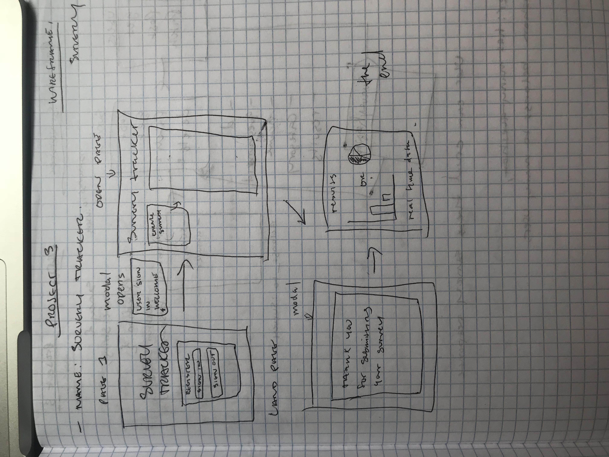

  ## Survey Tracker
    https://nsyncc.github.io/surveyFrontEnd/

# Description
    This is a web app designed to help you create and take surveys. Some of the functionalities include; being able to create a new survey on the fly, share unique links with friends, and take surveys. 
# Tech Stack
    This web app was made using the following :
* JavaScript
* Ajax
* Jquery
* Bootstrap
* HTML

# Wireframes

# Back End Link

- https://github.com/nSyncc/surveyBackEnd

# Process
    We spent the entire first day planning out how we wanted the project to look, and how we wanted it to work. We drew up ERD's and WireFrames to help with this process, along with some whiteboarding of the initial starter code. We then used Agile Methodologies by having standups at the beginning and end of each day.

# Issues
    Our only issues were team communication issues, but we eventually solved those by talking through all of our issues with our communication and code.
    
# Future Plans
    In the future we are not planning on implementing new futures.

## [License](LICENSE)

1. All content is licensed under a CC­BY­NC­SA 4.0 license.
2. All software code is licensed under GNU GPLv3. For commercial use or
    alternative licensing, please contact legal@ga.co.
